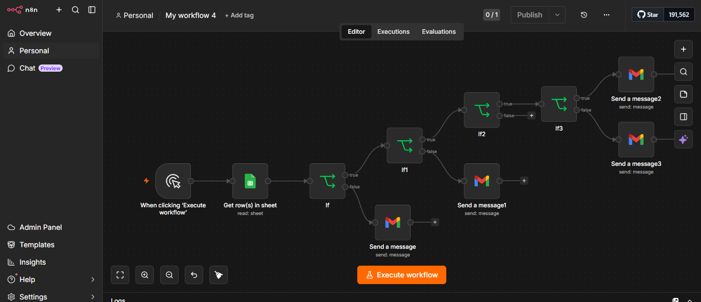
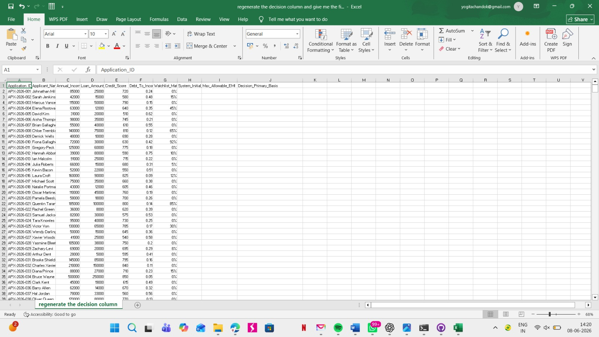
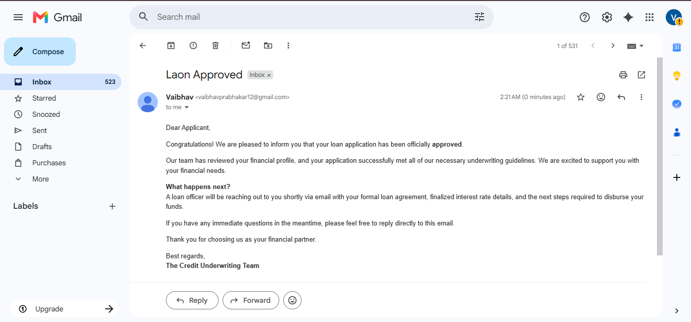
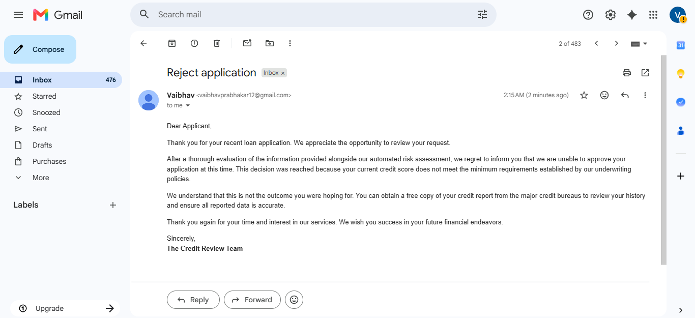

# Automated Credit Underwriting & Risk Assessment Workflow

An automated credit risk assessment and loan underwriting pipeline engineered using **n8n**, **Google Sheets**, and **Gmail**. This workflow dynamically fetches loan applicant profiles, evaluates financial risk metrics against strict underwriting policies, and automates downstream decision communications.

---

## 📌 Workflow Overview

The system automates a 4-tier decision tree logic to determine if an applicant qualifies for a loan, requires manual compliance review, or should be immediately rejected.

### ⚙️ Financial Rules Engine Structure
1. **Income Filter (`If`):** Annual Income must be >= $80,000. (Failed criteria -> Rejection Email: *Income is Low*)
2. **Credit Score Filter (`If1`):** Credit Score must be >= 680. (Failed criteria -> Rejection Email: *Low Credit Score*)
3. **Debt-to-Income Filter (`If2`):** DTI Ratio must be <= 0.40.
4. **Compliance Watchlist Filter (`If3`):** Watchlist Match % must equal 0%.
   * **Pass:** Automated Loan Approval Email issued.
   * **Fail (Watchlist > 0%):** Flagged for manual Compliance Check Review.

---

## 📊 Dataset & Architecture

### 1. Data Source (Google Sheets)
The workflow reads real-time client applications from a master ledger containing crucial credit parameters such as `Annual_Income_USD`, `Credit_Score`, `Debt_To_Income_Ratio`, and `Watchlist_Match_Pct`.

### 2. Automated Communication Nodes (Gmail)
Based on the criteria results, personalized notifications are dispatched immediately to manage candidate workflows cleanly:

* **Approval Notification Sample:**
  

* **Rejection Notification Sample:**
  

---

## 🚀 How to Setup and Run This Project

### Prerequisites
* A running instance of **n8n** (Cloud or self-hosted Desktop/Docker)
* Google Workspace account (with Google Sheets & Gmail API permissions configured via OAuth2)

### Deployment Steps
1. **Clone this repository** or copy the JSON workflow architecture file (`N8n Workflow Architecture.json`).
2. Open your n8n workspace, click on the options menu on the top right, and select **Import from File** to upload the `.json` file.
3. Configure your **Google Sheets OAuth2 credentials** and connect the `Get row(s) in sheet` node to your own applicant data sheet.
4. Authenticate your **Gmail OAuth2 node** to allow the workflow to handle automated outgoing dispatches.
5. Hit **Execute workflow** to test or toggle **Active** to let it run autonomously on real-time events.
